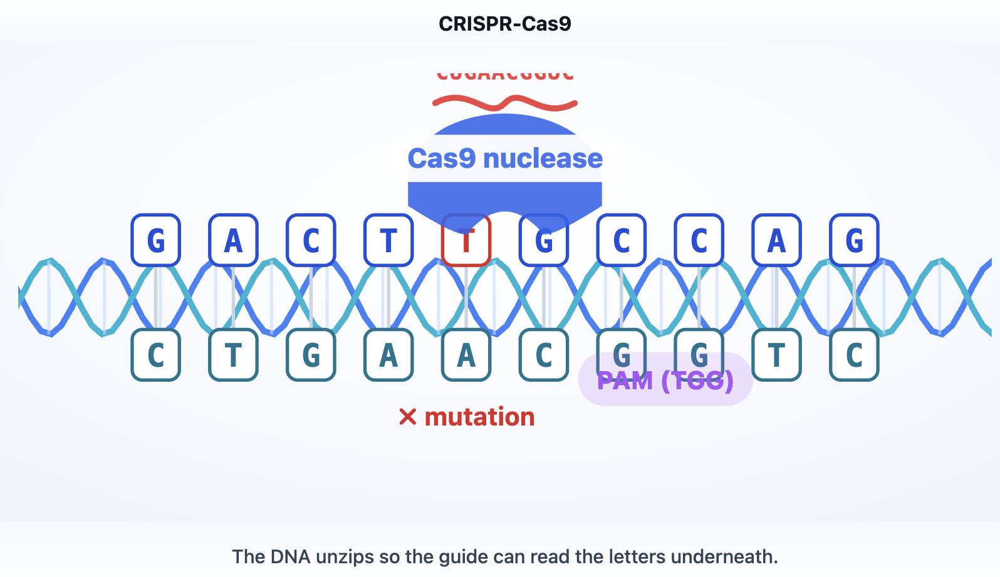

# Lattice

Most explanations start with a definition. Real understanding starts with **context** — why a concept matters, what you need to know first, and how it connects to what you already understand. Reading a wall of text rarely builds intuition, and every AI answer starts from scratch as if you'd never learned anything before.

Lattice is an adaptive explanation engine that does two things: it **shows** you how a concept works, and it **remembers** what you've learned so the next explanation builds on it.

---

## Two key features

### 1. Concept Studio — explanations you can *see*

Enter any concept or question. Lattice generates a structured learning card (summary → mechanism → key components → prerequisites → related) and — crucially — **picks the representation that fits the shape of the idea**: a process becomes an animation, a structure becomes a 3D model, a quantitative relationship becomes a plot you can drag, a system becomes a manipulable diagram. The goal isn't a picture to look at but a model to *poke at* — change an input and watch the consequence.

> **North star** — Ask *"How does CRISPR work?"* and you get a narrated animation: Cas9 scanning DNA, the guide RNA base-pairing to the target, the double-strand cut.
>
> 
>
> The same engine should answer *"why does compound interest explode?"* with a curve where you drag the rate and watch it pull away from linear; *"how does binary search work?"* by halving a list you can resize; *"how does a transformer read a sentence?"* by lighting up attention token to token; *"what is a protein's structure?"* with a 3D model you can rotate. One studio, many forms — each chosen to make *that* idea click.
>
> *(More screenshots coming soon.)*

### 2. Knowledge Atlas — a notebook that remembers

Every concept you view or save is recorded with a familiarity score and auto-organized into domains — no folders, no tagging. That memory makes every future explanation about *you*, not a generic reader.

> **North star** — concretely, because Lattice remembers what you know it can:
> - **Skip what you know, spend words on what's new** — ask about Transformers after learning attention and it won't re-teach attention; it builds straight on it.
> - **Explain in your terms** — draw analogies from concepts already in your atlas (*"like the chain rule you know from calculus…"*), because new ideas stick when anchored to old ones.
> - **Catch gaps before they block you** — notice you're missing a prerequisite and offer to cover it first, so you don't bounce off an explanation that assumes it.
> - **Right-size the depth** — intuition on the first encounter; edge cases and tradeoffs by the fifth.
> - **Chart a path to a goal** — *"I want to understand diffusion models"* becomes an ordered route from what you already know through the missing pieces.
> - **Refresh before you forget** — resurface a concept whose familiarity has decayed, especially right before you build on it.
>
> *(Screenshots coming soon.)*

---

## How it works

```
query → extract concept → personalize (atlas) → generate card (LLM)
                                              ↘ analyze → plan → render visualization
```

- **Personalization** ([backend/concept_service.py](backend/concept_service.py)) — builds a context from the user's known concepts (see the Knowledge Atlas below), ranking them by relevance to the current concept before handing the top ones to the LLM.
- **Visualization** ([backend/animation_director.py](backend/animation_director.py), [renderer.py](backend/renderer.py)) — the LLM emits a declarative `AnimationSpec` (actors + timeline) rendered by a generic player, with hand-authored fallbacks. Structural concepts route to three.js 3D scenes; a relevant Wikipedia diagram is shown alongside when one exists.
- **Stack** — Next.js + TypeScript (frontend), FastAPI + SQLAlchemy (backend), SQLite locally / Postgres in prod, Gemini or OpenAI for generation, fastembed for local concept embeddings.

### How the Knowledge Atlas works

The Atlas is a per-user **knowledge graph** that builds itself as you learn — no folders, tags, or manual linking. It's what every explanation is personalized against.

**Nodes** are concepts. A node is created the first time a concept is explained, or as a *stub* when it's named as a prerequisite/related concept of another card — so an idea can exist in the graph before you've explored it. Each node also stores a local **embedding** (fastembed / `bge-small`) used for semantic matching.

**Edges** are directed relationships (`prerequisite`, `related`), materialized from each generated card's prerequisite/related lists. The graph therefore grows from explanations, not hand-curation.

**Your knowledge is a separate per-user layer.** For every concept you've seen, Lattice tracks a familiarity score and view count (`user_concepts`). The graph of concepts is shared; what *you* know is personal.

- **Familiarity score (0–100):** +5 first view, +3 each revisit (capped), +10 when you save to your Atlas. It counts engagement, not mastery — so the card shows a coarse tier (*New to you · Seen before · Familiar*) instead of a fake-precise number.
- **Auto-organization:** each concept is assigned a domain by the LLM, and the Atlas groups your concepts into the domains you're growing.

**Personalization — relevance, not just recency.** When explaining concept X, Lattice scores everything you already know by how it relates to X, then hands the top ~12 to the LLM as "what this learner already understands":

- graph neighbors of X that you know → **+30**
- same-domain concepts → **+10**
- **embedding similarity** to X → blended in, so related concepts surface even with no stored edge (densifying a young graph)

That ranking is what lets a card say *"building on attention, which you already know…"* and draw analogies from *your* concepts. **Depth** then scales with how many times you've seen X — first principles → nuance → expert (the depth-mode badge).

**Dedup.** A new concept within high embedding similarity of an existing one merges into it, so "neural nets" and "Neural networks" don't fragment into separate nodes.

## Quick start

**Prerequisites:** Node 18+, Python 3.9+

```bash
# Backend (http://localhost:8000)
cd backend
pip install -r requirements.txt
echo "GEMINI_API_KEY=...  # or OPENAI_API_KEY + LLM_PROVIDER=openai" > .env
python main.py

# Frontend (http://localhost:3000) — new terminal
cd frontend
npm install && npm run dev
```

Open the frontend and enter a concept (e.g. *"How does CRISPR work?"*).

### Develop without spending LLM credits

- **Visualization Lab** — renders captured specs/scenes in the UI with no model call.
- **Tests** — all offline:
  ```bash
  cd backend
  python test_personalization.py   # personalization logic (in-memory DB)
  python test_cards.py             # replays recorded learning cards
  python test_visualization.py     # spec → SVG rendering
  ```
  `record_cards.py` is the only script that spends credits (records fixtures once).

> **Note:** the Gemini free tier allows ~20 requests/day; one explanation uses ~4 calls. Use a paid tier or `LLM_PROVIDER=openai` for sustained use.

---

## Roadmap

**Generalize the visualizations** — the biggest lever for the Studio north star. Today animation works well for process concepts and 3D for a few hand-tuned structures; the goal is *any* shape of idea.
- Add an **interactive** spec type (sliders/inputs that re-run the model) so a visualization becomes manipulable, not just playable.
- Expand the `AnimationSpec` primitive vocabulary so the LLM-director reliably depicts any domain (physics, economics, algorithms), plus a charting/simulation form for quantitative relationships.
- Build 3D models from web-sourced images/specs instead of hand-authored meshes, so any structure can be reconstructed.
- A reliable router (animation / 3D / interactive plot / diagram / static) with graceful fallback, plus an eval set to catch regressions.

**Make the Atlas practically personal** — the engineering behind the benefits above.
- **Relevance** — embedding similarity now augments the flat +30 graph bonus; next is to *replace* the bonus with fully similarity-weighted scoring (fixing the high-familiarity-noise case in `test_personalization.py` case E) and merge the duplicate nodes that predate dedup.
- **Decay model** — track familiarity decay over time to drive "refresh before you forget."
- **Path-finding** — shortest-path over the concept graph from known concepts to a goal, for learning paths.
- **Progress view** — surface growing domains and a timeline of what you've understood.
